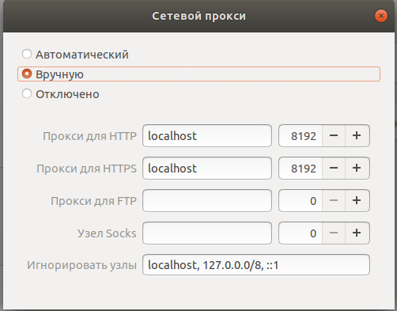
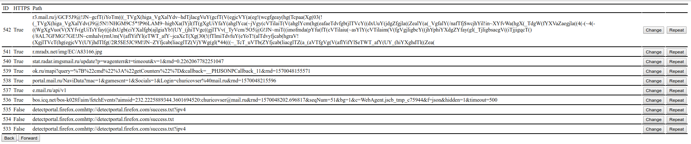
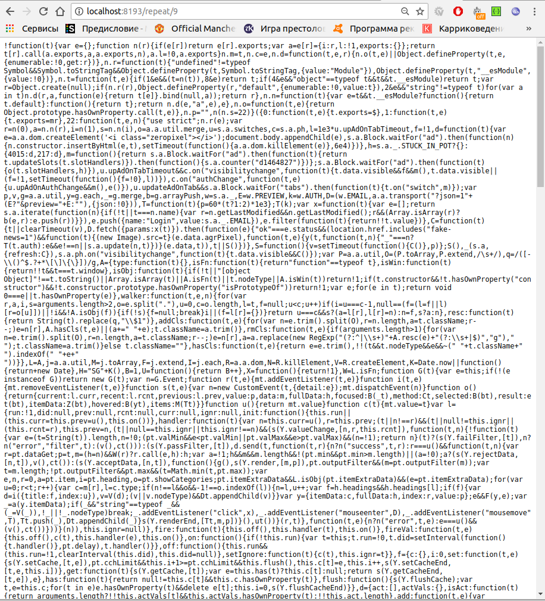
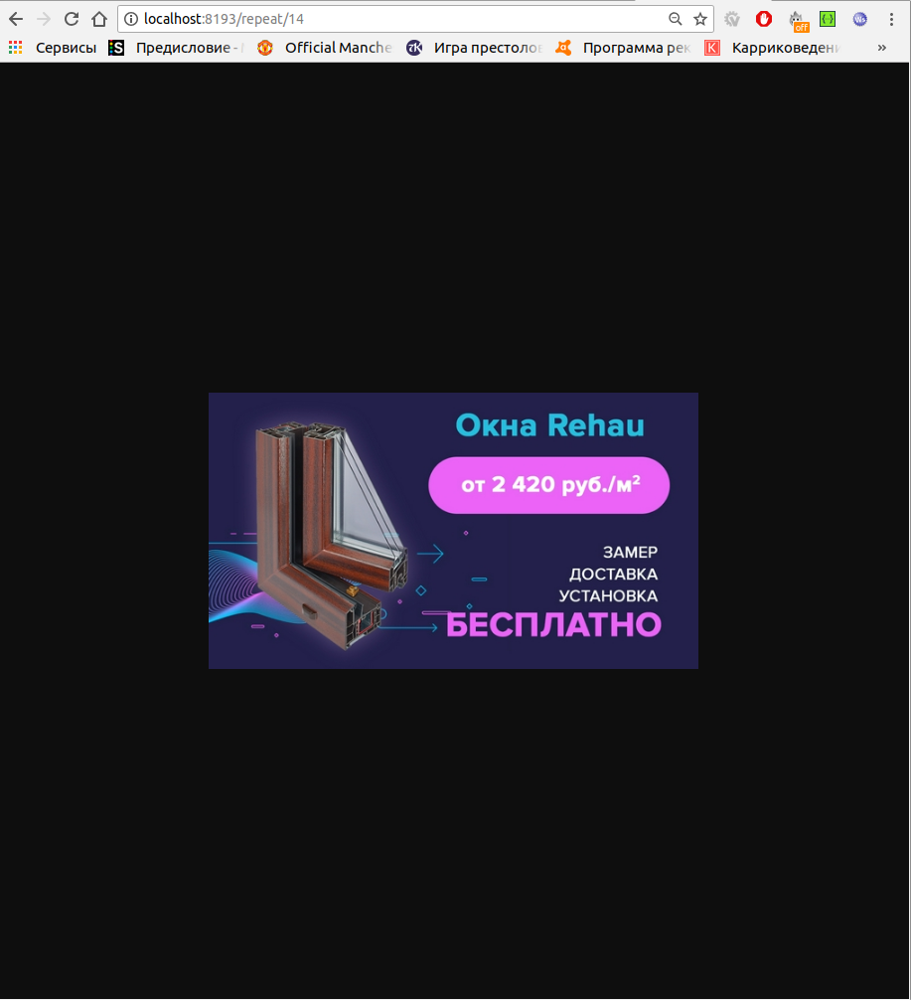
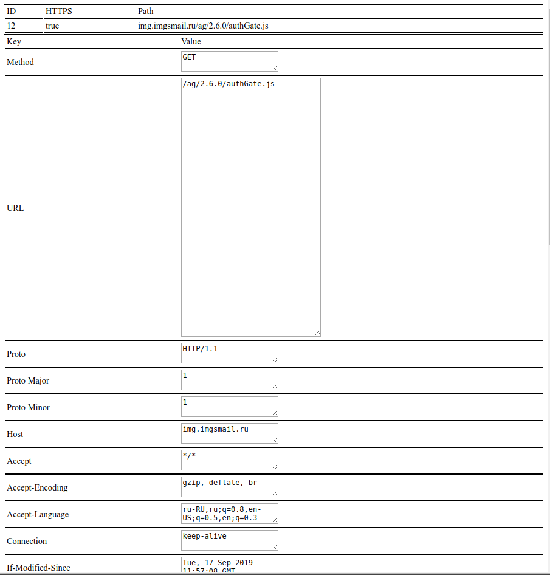

# go_http_proxy
HTTP Proxy for "Web Security" course in TP mail.ru

## Реализует:
 1. Проксирование HTTP запросов
 2. Проксирование HTTPS запросов
 3. Отправка сохраненного запроса
## Необходимое для запуска ПО
 1. Для запуска через докер:
    * docker-compose  
 2. Не через docker:
    * golang
    * go mod
    * postgresql
## Инструкция по запуску
 1. git clone git@github.com:sergeychur/go_http_proxy.git(или https://github.com/sergeychur/go_http_proxy.git
  при работе по https, а не ssh)
 2. Непосредственно запуск
 * 2.1 С докером
    * 2.1.0 sudo docker rm $(sudo docker ps -a -q)
    * 2.1.1 sudo docker-compose up --build
    * успех
 * 2.2 Без докера
    * 2.2.1 Залить в postgresql БД из файла internal/database/schema.sql
    * 2.2.2 go run ./cmd/proxy/main.go ./local_proxy_config.json
    * 2.2.3 go run ./cmd/repeater/main.go ./local_repeater_config.json
    
 3. Использование
 
 Прокси будет работать на порту 8192, повторитель сохраненных запросов на 8193
  * 3.1 Прокси
  * 3.1.1 Необходимо настроить перенаправку запросов на прокси.
    Пример для ubuntu:
    Настройки->Сеть->Сетевой прокси
    
    * 3.1.2 Импортировать корневой сертификат в браузер
    Пример для google chrome:
    Настрйки->Дополнительные->Настроить сертификаты->Центры Сертификации->Импорт
    Выбираем файл ca-cert.crt из корня проекта(он должен сгенерирваться при первом запуске proxy)
    * успех, можно пользоватсья браузером(прокси будет работать)
   * 3.2 Повторитель запросов
   
        Работа повторителя обеспечивается наличием сохраненных запросов в БД, то есть предыдущей работы прокси.
        
        Есть два режима, один при помощи json и прямого обращения к API, второй из браузера(в браузере могут некоторые моменты работать неадекватно, я не могу в js)
        * 3.2.1 Через браузер
        
            Переходим на http://localhost:8193
            
            
            
            Видим список сохраненных запросов. Здесь ID - ID в БД, isHTTPS - признак того, что запрос произведен по HTTPS, если False, то HTTP, иначе HTTPS,
            Path - url по которому выполнялся запрос. 
            Есть возможность просто повторить запрос, для этого необходимо нажать кнопку "Repeat" и изменить запрос, нажав кнопку "Change".
            Результат выполнения запроса рендерится браузером, корректно обрабатывается html ответ, картинка, текст, json, js код, остальное либо скачивается, либо отображается как blob.
            Пример отображения повторенного запроса:
            
            
            Тут отобразился JS файлик.
            
            Пример отображения картинки:
            
            
            Редактирование запроса:
            
            
            По нажатии кнопки "Send" выполнится запрос и опять же ответ отрендерится в браузере.
            
        * 3.2.2 Через API
        
        ##GET 
        /api/history
        параметры в URL rows - количество запросов на страницу, page - номер страницы
        Пример: http://localhost:8193/api/history?rows=10&page=1
        
        ##GET
        /api/request/{id}
        параметр в пути id - номер запроса
        получить параметры запроса в виде JSON. Практически все поля дублируют поля структуры Request из пакета net/http языка Golang. Добавлены id запроса в БД и признак HTTPS запроса
        
        ##PUT
        /api/request/{id}
        параметр в пути id - номер запроса
        Повторить запрос с id={id}. Возвращает ответ сервера.
        
        ##POST
        /api/request/
        В теле запроса должен быть json установленного формата. Выполняет переданный измененный запрос и сохраняет его в БД.
        
        Формат JSON(на примере одного из запросов):
        ```json
        {
         "id":1,
         "is_https":false,
         "path":"http://bigor.bmstu.ru/",
         "request":{
                     "method":"GET",
                     "path":"http://bigor.bmstu.ru/",
                     "proto":"HTTP/1.1",
                     "proto_major":1,
                     "proto_minor":1,
                     "host":"bigor.bmstu.ru",
                     "header":{
                               "Accept":["text/html,application/xhtml+xml,application/xml;q=0.9,*/*;q=0.8"],
                               "Accept-Encoding":["gzip","deflate"],
                               "Accept-Language":["ru-RU,ru;q=0.8,en-US;q=0.5,en;q=0.3"],
                               "Connection":["keep-alive"],
                               "Cookie":["_ga=GA1.2.484333667.1569884374; _gid=GA1.2.1047068605.1569884374"],
                               "Upgrade-Insecure-Requests":["1"],
                               "User-Agent":["Mozilla/5.0 (X11; Ubuntu; Linux x86_64; rv:69.0) Gecko/20100101 Firefox/69.0"],
                             },
                     "body":null,
                     "trailer":{},
                     "content_length":0,
                     "transfer_encoding":[""],
                     "close":false,
                     "form":"",
                     "post_form":"",
                     "remote_addr":"172.19.0.1:46140",
                     "request_uri":"http://bigor.bmstu.ru/",
                },
         }
        
